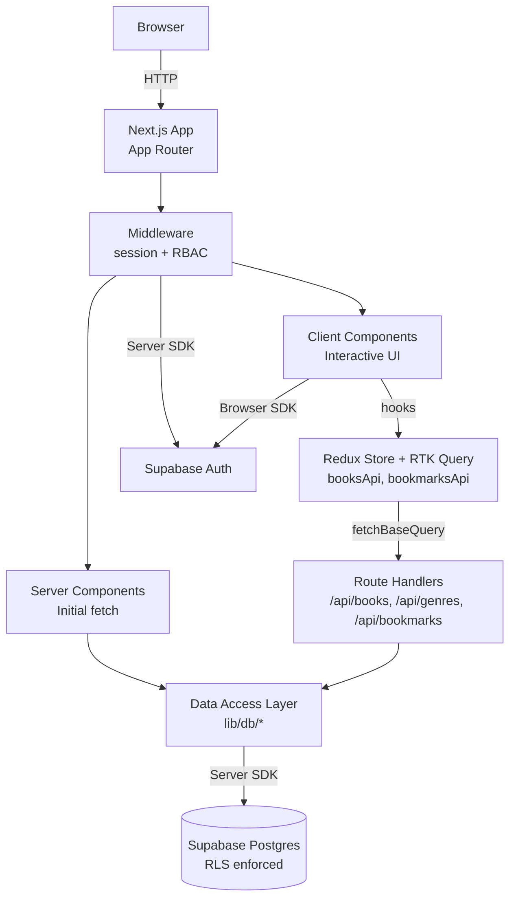
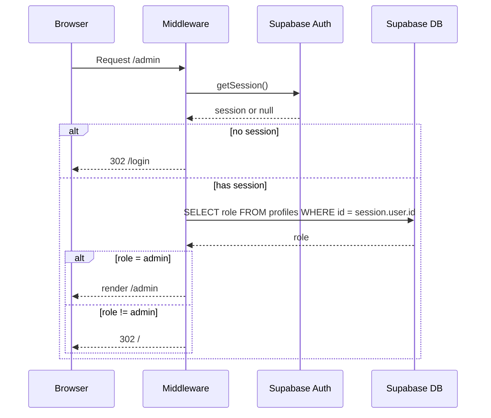
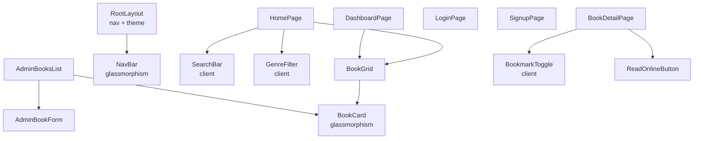

# Design Document

## Overview

The Online Library Catalog is a Next.js 14+ application using the App Router, server components, and route handlers, backed by Supabase for authentication and PostgreSQL data. The frontend uses Tailwind CSS with a custom dark-amber theme and glassmorphism utilities. Server components fetch data directly from Supabase using a server-side client for the initial render of every page. Client components — search, genre filter, bookmark toggle, admin forms, and the dashboard's inline remove control — use **Redux Toolkit Query (RTK Query)** for all subsequent data fetching, mutations, and cache management. RTK Query talks to Next.js route handlers, which in turn call the data access layer over Supabase. Row Level Security (RLS) policies enforce authorization at the database layer, complementing Next.js middleware that protects authenticated and admin routes.

The design choices prioritize:
- **Server-first rendering** for the Home_Page, Book_Detail_Page, Dashboard_Page, and Admin_Panel to keep initial loads fast and SEO-friendly.
- **A single client-side data layer** (RTK Query) with tag-based cache invalidation, so interactive updates stay consistent across components without ad-hoc state plumbing.
- **Database-enforced authorization** via RLS so client-side bypasses cannot leak data or allow unauthorized writes.
- **Manual content curation** via an admin form with strict input validation; no ingestion pipelines.

## Architecture

### High-Level Architecture



### Route Map

| Route | Type | Auth | Description |
|---|---|---|---|
| `/` | Server Component | Public | Home_Page with hero, Search_Bar, Genre_Filter, book grid |
| `/book/[id]` | Server Component | Public | Book_Detail_Page with Read_Online_Button and bookmark toggle |
| `/login` | Client Component | Public | Login form |
| `/signup` | Client Component | Public | Signup form |
| `/dashboard` | Server Component | User | Dashboard_Page with bookmarked books |
| `/admin` | Server Component | Admin | Admin_Panel: list + add/edit/delete books |
| `/admin/books/new` | Server Component | Admin | Add book form |
| `/admin/books/[id]/edit` | Server Component | Admin | Edit book form |
| `/api/books` | Route Handler | Public read; Admin write | GET (list with `q`/`genre`), POST (create) |
| `/api/books/[id]` | Route Handler | Public read; Admin write | GET, PUT, DELETE |
| `/api/genres` | Route Handler | Public | GET distinct genres |
| `/api/bookmarks` | Route Handler | User | GET (own), POST (add), DELETE (remove) |
| `/api/bookmarks/check` | Route Handler | User | GET `?bookId=` returns `{ bookmarked: boolean }` |

Public routes are rendered without authentication. The middleware reads the Supabase session cookie and rewrites or redirects requests based on the route's auth requirement.

### Authentication and Authorization Flow



### Supabase Client Strategy

Two Supabase client instances are used:

- **Server Client** (`createServerClient`): Used in server components, route handlers, and middleware. Reads/writes session cookies via the Next.js cookies API.
- **Browser Client** (`createBrowserClient`): Used in client components for interactive operations (login, bookmark toggle, admin forms). The session is automatically synchronized with the cookie store.

Both clients use the public anon key. RLS policies in Postgres are the source of truth for authorization. The service role key is never exposed to the browser; it is only used in trusted server-side operations that need to bypass RLS (none required in the current design).

### Client-Side Data Layer (Redux Toolkit Query)

Interactive client components consume data through Redux Toolkit Query (RTK Query). The store hosts two API slices — `booksApi` and `bookmarksApi` — and the rest of the application state stays in component-local state. Server components are unaffected and continue to fetch through the data access layer for the initial render.

#### baseQuery choice: route handlers, not direct Supabase

Both slices use `fetchBaseQuery` pointed at the Next.js route handlers (`/api/books`, `/api/genres`, `/api/bookmarks`). Going through route handlers — rather than wrapping the Supabase browser client in a custom `baseQuery` — is the cleaner choice because:

1. The route handlers already exist as the chokepoint for write operations and Zod validation, so reads use the same path.
2. `fetchBaseQuery` is the off-the-shelf primitive; a Supabase-backed custom baseQuery would have to translate `PostgrestError` into the `{ data, error }` shape RTK Query expects, with no real upside for a thin client.
3. Authorization is uniform: the route handler reads the session from cookies and does not rely on the browser session being in sync.
4. Tests mock the HTTP layer once with MSW and reuse those mocks for every component test.

The accepted trade-off is one extra hop through the Next.js server. The catalog is small, reads are cached client-side via tag invalidation, and the cost is negligible.

#### Endpoints, tags, and cache invalidation

```typescript
// lib/store/booksApi.ts
import { createApi, fetchBaseQuery } from '@reduxjs/toolkit/query/react'

export const booksApi = createApi({
  reducerPath: 'booksApi',
  baseQuery: fetchBaseQuery({ baseUrl: '/api/' }),
  tagTypes: ['Books', 'Genres'],
  endpoints: (b) => ({
    listBooks: b.query<Book[], { search?: string; genre?: string } | void>({
      query: (args) => ({
        url: 'books',
        params: { q: args?.search ?? '', genre: args?.genre ?? '' },
      }),
      providesTags: (result) =>
        result
          ? [
              ...result.map((bk) => ({ type: 'Books' as const, id: bk.id })),
              { type: 'Books', id: 'LIST' },
            ]
          : [{ type: 'Books', id: 'LIST' }],
    }),
    getBookById: b.query<Book, string>({
      query: (id) => `books/${id}`,
      providesTags: (_r, _e, id) => [{ type: 'Books', id }],
    }),
    listGenres: b.query<string[], void>({
      query: () => 'genres',
      providesTags: [{ type: 'Genres', id: 'LIST' }],
    }),
    createBook: b.mutation<Book, BookInput>({
      query: (body) => ({ url: 'books', method: 'POST', body }),
      invalidatesTags: [
        { type: 'Books', id: 'LIST' },
        { type: 'Genres', id: 'LIST' },
      ],
    }),
    updateBook: b.mutation<Book, { id: string; input: BookInput }>({
      query: ({ id, input }) => ({ url: `books/${id}`, method: 'PUT', body: input }),
      invalidatesTags: (_r, _e, { id }) => [
        { type: 'Books', id },
        { type: 'Books', id: 'LIST' },
        { type: 'Genres', id: 'LIST' },
      ],
    }),
    deleteBook: b.mutation<void, string>({
      query: (id) => ({ url: `books/${id}`, method: 'DELETE' }),
      invalidatesTags: (_r, _e, id) => [
        { type: 'Books', id },
        { type: 'Books', id: 'LIST' },
        { type: 'Genres', id: 'LIST' },
      ],
    }),
  }),
})

export const {
  useListBooksQuery,
  useGetBookByIdQuery,
  useListGenresQuery,
  useCreateBookMutation,
  useUpdateBookMutation,
  useDeleteBookMutation,
} = booksApi
```

```typescript
// lib/store/bookmarksApi.ts
export const bookmarksApi = createApi({
  reducerPath: 'bookmarksApi',
  baseQuery: fetchBaseQuery({ baseUrl: '/api/' }),
  tagTypes: ['Bookmarks'],
  endpoints: (b) => ({
    listBookmarksForUser: b.query<Book[], void>({
      query: () => 'bookmarks',
      providesTags: [{ type: 'Bookmarks', id: 'LIST' }],
    }),
    isBookmarked: b.query<boolean, string>({
      query: (bookId) => ({ url: 'bookmarks/check', params: { bookId } }),
      transformResponse: (resp: { bookmarked: boolean }) => resp.bookmarked,
      providesTags: (_r, _e, bookId) => [{ type: 'Bookmarks', id: bookId }],
    }),
    addBookmark: b.mutation<void, string>({
      query: (bookId) => ({ url: 'bookmarks', method: 'POST', body: { bookId } }),
      invalidatesTags: (_r, _e, bookId) => [
        { type: 'Bookmarks', id: 'LIST' },
        { type: 'Bookmarks', id: bookId },
      ],
    }),
    removeBookmark: b.mutation<void, string>({
      query: (bookId) => ({ url: 'bookmarks', method: 'DELETE', body: { bookId } }),
      invalidatesTags: (_r, _e, bookId) => [
        { type: 'Bookmarks', id: 'LIST' },
        { type: 'Bookmarks', id: bookId },
      ],
    }),
  }),
})

export const {
  useListBookmarksForUserQuery,
  useIsBookmarkedQuery,
  useAddBookmarkMutation,
  useRemoveBookmarkMutation,
} = bookmarksApi
```

Tag taxonomy:
- `Books`: list cache (`id: 'LIST'`) and per-book caches keyed by book id; invalidated by every book mutation
- `Genres`: distinct genre list; invalidated when a book is created/updated/deleted (because a new genre may appear or an old one may disappear)
- `Bookmarks`: per-user list (`id: 'LIST'`) and per-(bookId) `isBookmarked` cache; invalidated by add/remove

#### Store, Provider, and layout mounting

```typescript
// lib/store/store.ts
import { configureStore } from '@reduxjs/toolkit'
import { booksApi } from './booksApi'
import { bookmarksApi } from './bookmarksApi'

export const makeStore = () =>
  configureStore({
    reducer: {
      [booksApi.reducerPath]: booksApi.reducer,
      [bookmarksApi.reducerPath]: bookmarksApi.reducer,
    },
    middleware: (gDM) =>
      gDM().concat(booksApi.middleware, bookmarksApi.middleware),
  })

export type AppStore = ReturnType<typeof makeStore>
export type RootState = ReturnType<AppStore['getState']>
export type AppDispatch = AppStore['dispatch']
```

```typescript
// app/providers.tsx — client component
'use client'
import { Provider } from 'react-redux'
import { useRef } from 'react'
import { makeStore, type AppStore } from '@/lib/store/store'

export function Providers({ children }: { children: React.ReactNode }) {
  const storeRef = useRef<AppStore | null>(null)
  if (!storeRef.current) storeRef.current = makeStore()
  return <Provider store={storeRef.current}>{children}</Provider>
}
```

`Providers` is mounted once near the root of `app/layout.tsx`:

```tsx
// app/layout.tsx
import { Providers } from './providers'

export default function RootLayout({ children }: { children: React.ReactNode }) {
  return (
    <html lang="en">
      <body className="bg-bg text-white">
        <Providers>
          <NavBar />
          <main className="animate-fade-in">{children}</main>
        </Providers>
      </body>
    </html>
  )
}
```

Server components in the tree continue to render and fetch data normally; they do not subscribe to the store. The store is only consumed by the client islands inside the tree.

#### Server-vs-client division

| Surface | Initial render (server) | Interactive updates (client, RTK Query) |
|---|---|---|
| `/` Home_Page | `listBooks({ search, genre })` from data access layer | `useListBooksQuery({ search, genre })` reacting to SearchBar / GenreFilter changes; `useListGenresQuery()` for filter buttons |
| `/book/[id]` | `getBookById`, `isBookmarked` | `useAddBookmarkMutation` / `useRemoveBookmarkMutation` from BookmarkToggle; `useIsBookmarkedQuery` keeps the indicator in sync |
| `/dashboard` | `listBookmarksForUser` for first paint | `useListBookmarksForUserQuery()` + `useRemoveBookmarkMutation` for the inline remove control |
| `/admin` | `listBooks` for first paint | `useListBooksQuery()`, `useCreateBookMutation`, `useUpdateBookMutation`, `useDeleteBookMutation` from AdminBookForm and the per-row delete button |

## Components and Interfaces

### Frontend Components



### Component Interfaces

**BookCard**
```typescript
interface BookCardProps {
  book: Pick<Book, 'id' | 'title' | 'author' | 'genre' | 'cover_url'>
  onRemove?: () => void  // shown on dashboard for quick unbookmark
}
```

**SearchBar** (client component, RTK Query consumer)
```typescript
interface SearchBarProps {
  initialQuery?: string
}
// behavior: writes the query into shared client state (URL ?q= + the
// args passed to useListBooksQuery in the parent client island), debounced 250ms.
// The parent island re-issues useListBooksQuery({ search, genre }) and rerenders.
```

**GenreFilter** (client component, RTK Query consumer)
```typescript
interface GenreFilterProps {
  selected: string | 'all'
}
// behavior: hydrates its button list from useListGenresQuery();
// on click, updates the URL ?genre= and the selected arg passed to
// useListBooksQuery in the parent client island. "All" clears the genre arg.
```

**BookmarkToggle** (client component, RTK Query consumer)
```typescript
interface BookmarkToggleProps {
  bookId: string
  initialBookmarked: boolean   // resolved server-side; primes the cache
}
// behavior: reads useIsBookmarkedQuery(bookId) for the indicator, primed by
// initialBookmarked. On click, calls useAddBookmarkMutation / useRemoveBookmarkMutation;
// the mutation's invalidatesTags refreshes both the indicator and the dashboard list.
// Optimistic update via updateQueryData in onQueryStarted; on error, the patch is undone
// and a toast surfaces the failure.
```

**AdminBookForm** (client component, RTK Query consumer)
```typescript
interface AdminBookFormProps {
  initialValues?: Book   // present in edit mode
  mode: 'create' | 'edit'
}
// behavior: validates with BookInputSchema client-side, then calls
// useCreateBookMutation or useUpdateBookMutation. Field-level errors come from
// the route handler's 400 response. invalidatesTags refreshes the admin list and
// any subscribed home/dashboard caches.
```

### Data Access Layer

A small set of server-side functions encapsulate all Supabase queries. Each function accepts a Supabase client (the caller controls server vs browser context). Server components call these directly for the initial render; route handlers call them on behalf of RTK Query for subsequent client-side requests.

```typescript
// lib/db/books.ts
listBooks(client, opts?: { search?: string; genre?: string }): Promise<Book[]>
getBookById(client, id: string): Promise<Book | null>
listGenres(client): Promise<string[]>           // distinct genres
createBook(client, input: BookInput): Promise<Book>
updateBook(client, id: string, input: BookInput): Promise<Book>
deleteBook(client, id: string): Promise<void>

// lib/db/bookmarks.ts
listBookmarksForUser(client, userId: string): Promise<Book[]>
isBookmarked(client, userId: string, bookId: string): Promise<boolean>
addBookmark(client, userId: string, bookId: string): Promise<void>
removeBookmark(client, userId: string, bookId: string): Promise<void>

// lib/db/profiles.ts
getProfile(client, userId: string): Promise<Profile | null>
isAdmin(client, userId: string): Promise<boolean>
```

`listBooks` performs filtering at the database layer using Supabase query builder:
- `search`: `or(title.ilike.%q%, author.ilike.%q%)`
- `genre`: `eq('genre', genre)`

### Middleware

```typescript
// middleware.ts (Next.js)
export async function middleware(req: NextRequest) {
  const { supabase, response } = createMiddlewareClient(req)
  const { data: { session } } = await supabase.auth.getSession()
  const path = req.nextUrl.pathname

  if (path.startsWith('/admin')) {
    if (!session) return redirect('/login')
    const isAdmin = await checkAdmin(supabase, session.user.id)
    if (!isAdmin) return redirect('/')
  }
  if (path.startsWith('/dashboard')) {
    if (!session) return redirect('/login')
  }
  return response
}
```

## Data Models

### Postgres Schema

```sql
-- books
create table public.books (
  id            uuid primary key default gen_random_uuid(),
  title         text not null check (length(trim(title)) > 0),
  author        text not null check (length(trim(author)) > 0),
  description   text not null default '',
  genre         text not null check (length(trim(genre)) > 0),
  cover_url     text not null check (cover_url ~ '^https?://'),
  external_link text not null check (external_link ~ '^https?://'),
  created_at    timestamptz not null default now()
);
create index books_genre_idx on public.books (genre);
create index books_title_trgm on public.books using gin (title gin_trgm_ops);
create index books_author_trgm on public.books using gin (author gin_trgm_ops);

-- profiles (1-1 with auth.users)
create type user_role as enum ('admin', 'user');
create table public.profiles (
  id    uuid primary key references auth.users(id) on delete cascade,
  email text not null unique,
  role  user_role not null default 'user'
);

-- trigger: create profile on new auth.users row
create function public.handle_new_user() returns trigger as $$
begin
  insert into public.profiles (id, email, role)
  values (new.id, new.email, 'user');
  return new;
end;
$$ language plpgsql security definer;
create trigger on_auth_user_created
  after insert on auth.users
  for each row execute procedure public.handle_new_user();

-- bookmarks
create table public.bookmarks (
  id      uuid primary key default gen_random_uuid(),
  user_id uuid not null references public.profiles(id) on delete cascade,
  book_id uuid not null references public.books(id) on delete cascade,
  created_at timestamptz not null default now(),
  unique (user_id, book_id)
);
create index bookmarks_user_idx on public.bookmarks (user_id);
```

### Row Level Security Policies

```sql
alter table public.books enable row level security;
alter table public.profiles enable row level security;
alter table public.bookmarks enable row level security;

-- books: anyone can read; only admins can write
create policy "books read" on public.books for select using (true);
create policy "books admin write" on public.books for all
  using (exists (select 1 from public.profiles p
                 where p.id = auth.uid() and p.role = 'admin'))
  with check (exists (select 1 from public.profiles p
                      where p.id = auth.uid() and p.role = 'admin'));

-- profiles: user can read own profile; admins can read all
create policy "profile self read" on public.profiles for select
  using (id = auth.uid()
         or exists (select 1 from public.profiles p
                    where p.id = auth.uid() and p.role = 'admin'));

-- bookmarks: user can CRUD their own bookmarks
create policy "bookmark self read" on public.bookmarks for select
  using (user_id = auth.uid());
create policy "bookmark self write" on public.bookmarks for all
  using (user_id = auth.uid()) with check (user_id = auth.uid());
```

### TypeScript Models

```typescript
type UUID = string
type ISOTimestamp = string

export interface Book {
  id: UUID
  title: string
  author: string
  description: string
  genre: string
  cover_url: string       // https? URL
  external_link: string   // https? URL
  created_at: ISOTimestamp
}

export interface BookInput {
  title: string
  author: string
  description: string
  genre: string
  cover_url: string
  external_link: string
}

export type UserRole = 'admin' | 'user'

export interface Profile {
  id: UUID
  email: string
  role: UserRole
}

export interface Bookmark {
  id: UUID
  user_id: UUID
  book_id: UUID
  created_at: ISOTimestamp
}
```

### Validation Rules

`BookInput` is validated with a Zod schema before any insert/update:

```typescript
const urlSchema = z.string().trim().url().regex(/^https?:\/\//)
export const BookInputSchema = z.object({
  title: z.string().trim().min(1).max(300),
  author: z.string().trim().min(1).max(200),
  description: z.string().max(5000).default(''),
  genre: z.string().trim().min(1).max(100),
  cover_url: urlSchema,
  external_link: urlSchema,
})
```

### Theme Tokens

```typescript
// tailwind.config.ts
export default {
  theme: {
    extend: {
      colors: {
        bg: { DEFAULT: '#0f172a' },
        accent: { DEFAULT: '#fbbf24' },
      },
      backdropBlur: { glass: '12px' },
    },
  },
}
// utility class set: .glass = bg-white/5 backdrop-blur-glass border border-white/10
```

Responsive grid breakpoints:
- `grid-cols-1` (default, ≤640px)
- `sm:grid-cols-2` (641–1024px)
- `lg:grid-cols-3 xl:grid-cols-4` (>1024px)


## Correctness Properties

A property is a characteristic or behavior that should hold true across all valid executions of a system - essentially, a formal statement about what the system should do. Properties serve as the bridge between human-readable specifications and machine-verifiable correctness guarantees. The properties below were derived by analyzing every acceptance criterion (see prework), eliminating redundant properties, and consolidating equivalent statements.

### Property 1: Schema constraints reject invalid values
*For any* uuid that does not exist in `profiles`, inserting a `bookmarks` row with that uuid as `user_id` SHALL fail; the same SHALL hold for `book_id` against `books`; *for any* string not equal to `"admin"` or `"user"`, setting it as `profiles.role` SHALL fail.
**Validates: Requirements 1.4, 1.5, 1.6**

### Property 2: Bookmarks are unique per (user, book)
*For any* user_id and book_id, at most one `bookmarks` row SHALL exist with that pair; a second insert with the same pair SHALL fail.
**Validates: Requirements 1.7**

### Property 3: Search and genre filter agree with the in-memory model
*For any* set of books B, search query q, and selected genre g (or "all"), the books returned by the catalog query SHALL equal `{ b in B | (q == "" or q.lower() in b.title.lower() or q.lower() in b.author.lower()) and (g == "all" or b.genre == g) }`.
**Validates: Requirements 2.2, 3.1, 3.2, 3.4, 4.1, 4.2, 4.3**

### Property 4: BookCard renders all required fields
*For any* book b, the rendered BookCard output SHALL contain b.title, b.author, b.genre, and an image element whose src equals b.cover_url.
**Validates: Requirements 2.4**

### Property 5: Genre filter buttons match distinct genres in books
*For any* set of books B, the set of Genre_Filter buttons rendered on the Home_Page SHALL equal `{ b.genre | b in B } ∪ { "All" }`.
**Validates: Requirements 2.3**

### Property 6: Book detail page renders all fields and Read Online link
*For any* book b, the rendered Book_Detail_Page for b.id SHALL contain b.title, b.author, b.description, b.genre, an image with src equal to b.cover_url, and an anchor element whose href equals b.external_link.
**Validates: Requirements 5.1, 5.2**

### Property 7: Missing book id renders not-found
*For any* uuid id not present in the books table, navigating to `/book/{id}` SHALL render a "book not found" message and SHALL NOT render any Book_Card or Read_Online_Button.
**Validates: Requirements 5.4**

### Property 8: Signup creates a profile with role "user"
*For any* valid (email, password) pair where the email is not already registered, after a successful signup there SHALL exist exactly one `profiles` row with the new user's id, the submitted email, and role = "user".
**Validates: Requirements 6.1**

### Property 9: Login succeeds iff credentials match a registered user
*For any* (email, password), login SHALL succeed if and only if a user account exists with that email and password.
**Validates: Requirements 6.2, 6.3**

### Property 10: Duplicate-email signup is rejected
*For any* email already registered in `auth.users`, a subsequent signup attempt with that email SHALL fail and SHALL NOT create a new `profiles` row.
**Validates: Requirements 6.4**

### Property 11: Short-password signup is rejected
*For any* password with length less than 8, signup SHALL fail validation and SHALL NOT create a profile.
**Validates: Requirements 6.7**

### Property 12: Authenticated navigation shows the user's email
*For any* active session belonging to user u, the rendered navigation bar SHALL contain the text u.email and a logout control.
**Validates: Requirements 6.6**

### Property 13: Bookmark toggle round-trip is identity and reflects current state
*For any* (user u, book b) pair, invoking the BookmarkToggle through the `useAddBookmarkMutation` / `useRemoveBookmarkMutation` hooks twice in succession SHALL leave the database state unchanged with respect to bookmarks for (u, b); after a single toggle, the rendered toggle's "bookmarked" indicator (sourced from `useIsBookmarkedQuery`) SHALL match the existence of a bookmarks row for (u, b).
**Validates: Requirements 7.2, 7.3, 7.4, 8.4**

### Property 14: Bookmark writes require an authenticated session
*For any* HTTP request to the bookmark write endpoint without a valid session, the response SHALL be a redirect to `/login` or a 401 status, and no `bookmarks` row SHALL be created or deleted.
**Validates: Requirements 7.5**

### Property 15: Dashboard shows exactly the user's bookmarked books
*For any* user u and *for any* set of bookmarks owned by u, the set of Book_Cards rendered on the Dashboard_Page SHALL equal `{ books.find(b.book_id) | b in bookmarks where b.user_id == u.id }`.
**Validates: Requirements 8.1**

### Property 16: Route access control by role
*For any* protected route r with required role role_r in {"user", "admin"} and *for any* requesting principal with role role_p in {"visitor", "user", "admin"}, the request SHALL succeed iff role_p satisfies role_r (admin satisfies "user" and "admin"; user satisfies "user"; visitor satisfies neither). Otherwise the response SHALL redirect: visitors to `/login`, and authenticated non-admins to `/`. The same SHALL hold for direct database writes via RLS: only admins can insert/update/delete books.
**Validates: Requirements 8.5, 9.2, 9.3, 9.4, 14.2**

### Property 17: BookInput validation rejects invalid inputs
*For any* `BookInput` value that is missing a required field, has a blank-after-trim title/author/genre, or has a `cover_url` or `external_link` that does not match `^https?://`, the validation schema SHALL reject the input and the system SHALL NOT create or update a books row from it.
**Validates: Requirements 10.4, 10.5, 14.3**

### Property 18: Admin create/update yields a row matching the input
*For any* valid `BookInput` i submitted by an admin via create, after the operation there SHALL exist a books row with the field values from i and a non-null `created_at`. *For any* existing book b and valid `BookInput` i submitted via update, after the operation the books row with id = b.id SHALL have the field values from i.
**Validates: Requirements 10.1, 10.2**

### Property 19: Admin delete removes the book and its bookmarks
*For any* book b and *for any* set of bookmarks referencing b, after an admin deletes b, the books row with id = b.id SHALL no longer exist, and no `bookmarks` row with `book_id = b.id` SHALL exist.
**Validates: Requirements 10.3**

### Property 20: Admin panel lists one row with edit/delete per book
*For any* set of books B, the Admin_Panel SHALL render exactly |B| rows, and each row SHALL contain an edit control and a delete control referencing the corresponding book.id.
**Validates: Requirements 10.6**

### Property 21: Accent color is applied to interactive elements
*For any* primary interactive element rendered by the Catalog_System (primary buttons, the active Genre_Filter button), its computed color or background SHALL include the accent token `#fbbf24`.
**Validates: Requirements 11.2**

### Property 22: BookCard uses glassmorphism utilities
*For any* rendered BookCard, the root element's class list SHALL include the glassmorphism utility set (semi-transparent background, backdrop blur, border).
**Validates: Requirements 11.3**

### Property 23: Hover and page-fade transition durations are within bounds
*For any* rendered BookCard, the CSS transition-duration applied to the hover effect SHALL be in [150ms, 300ms]. *For any* page-level fade-in transition, the duration SHALL be in [150ms, 500ms].
**Validates: Requirements 12.1, 12.2**

### Property 24: Responsive grid columns match the viewport mapping
*For any* viewport width w >= 320, the rendered Home_Page SHALL produce zero horizontal overflow; if w <= 640 the book grid SHALL have 1 column and the navigation SHALL use the mobile menu; if 641 <= w <= 1024 the grid SHALL have at least 2 columns; if w > 1024 the grid SHALL have at least 3 columns.
**Validates: Requirements 13.1, 13.2, 13.3, 13.4, 13.5**

### Property 25: booksApi.listBooks argument-to-result equivalence
*For any* `(search, genre)` argument pair and *for any* set of books B served by the route handler, the resolved value of `useListBooksQuery({ search, genre })` SHALL equal `{ b in B | (search == "" or search.lower() in b.title.lower() or search.lower() in b.author.lower()) and (genre is undefined or genre == "all" or b.genre == genre) }`. Equivalently, the endpoint's `query(args)` SHALL emit a request to `/api/books` with query parameters `q = search ?? ''` and `genre = genre ?? ''`, and the route handler's response SHALL agree with the in-memory filter model from Property 3.
**Validates: Requirements 2.2, 3.1, 3.2, 3.4, 4.1, 4.2, 4.3**

### Property 26: Bookmark mutations invalidate and refetch the user's bookmarks
*For any* user u and *for any* book b, after a successful `useAddBookmarkMutation(b.id)` while a `useListBookmarksForUserQuery()` subscription for u is active, the cache entry tagged `{ type: 'Bookmarks', id: 'LIST' }` SHALL be invalidated, the query SHALL refetch, and the resolved list SHALL eventually contain b. Symmetrically, after a successful `useRemoveBookmarkMutation(b.id)`, the cache SHALL be invalidated, the query SHALL refetch, and the resolved list SHALL eventually exclude b. The same SHALL hold for the per-book `useIsBookmarkedQuery(b.id)` cache entry tagged `{ type: 'Bookmarks', id: b.id }`.
**Validates: Requirements 7.2, 7.3, 8.4**

## Error Handling

### Categories and Strategy

| Category | Detection point | User-facing behavior | Server-side behavior |
|---|---|---|---|
| Validation errors (BookInput, signup) | Zod schema before DB call | Inline form error per field; submission disabled | 400 response from route handler with `{ errors: { field: message } }` |
| Authentication failure | Supabase auth response | Toast: "Invalid email or password" | No PII in logs; structured log with auth error code |
| Authorization failure | Middleware + RLS | Redirect (visitor -> /login, user -> /) | Middleware redirect; RLS returns empty result or 403 |
| Not found | Server component for /book/[id] and /admin/books/[id]/edit | Custom not-found page | Next.js notFound() helper |
| Database errors | Supabase client | Toast: "Something went wrong, please try again" | Structured log with query context, no secrets |
| Network/transient errors | Browser client | Optimistic UI rolls back; toast prompt to retry | n/a |
| URL constraint violation (cover_url, external_link) | Zod regex + DB check | Inline form error | 400 response |
| Duplicate bookmark race | DB unique constraint | Treated as success (idempotent) | Catch unique-violation, return 200 |
| Cascading delete safety | DB ON DELETE CASCADE | Confirmation dialog before delete | Single transaction |

### Form Error UX

Every form (signup, login, admin add/edit) follows the same pattern: a Zod schema validates client-side first; a duplicate validation runs in the route handler (defense in depth). Server errors are mapped onto field-level errors when applicable; otherwise a single form-level error message is shown.

### Bookmark Optimistic UI

The bookmark toggle updates UI state immediately and issues the request in the background. On non-2xx response, the UI state reverts and a toast surfaces the error. A unique-violation race (double-tap) is treated as success.

### RLS as Backstop

Even if a UI bug allows a user to invoke a write, RLS rejects the operation. Tests cover this directly by issuing writes with the wrong session (Property 16).

## Testing Strategy

### Approach

Two complementary layers:

- **Unit and example tests** (Vitest + React Testing Library): cover specific examples, edge cases, error messages, and component rendering for fixed inputs.
- **Property-based tests** (`fast-check`): cover the universally quantified properties listed in the Correctness Properties section, with at least 100 iterations per property.

Each correctness property MUST be implemented by exactly one property-based test. The test MUST be tagged with a comment of the form:

```
// Feature: online-library-catalog, Property N: <property text>
```

### Frameworks and Tools

- **Vitest**: test runner for Node and jsdom environments
- **fast-check**: property-based testing for TypeScript
- **React Testing Library**: component rendering assertions
- **@testing-library/user-event**: simulated user interactions
- **MSW (Mock Service Worker)**: intercepts `fetch` to the route handlers in jsdom component tests, so RTK Query talks to a controllable in-memory backend without spinning up Next.js
- **Real Redux store** (`makeStore()` from `lib/store/store.ts`) wrapped in `<Provider>` via a `renderWithProviders(ui)` helper. We deliberately do not use `redux-mock-store` because it does not run RTK Query middleware and therefore cannot exercise tag-based invalidation.
- **Playwright**: end-to-end smoke tests for the Home_Page, Book_Detail_Page, Dashboard_Page, and Admin_Panel
- **Supabase local stack** (`supabase start`): provides a real Postgres + Auth instance for integration and DB-level property tests

### Test Layers

1. **Pure logic tests** (Vitest, no DB, no store): validate `BookInputSchema`, the in-memory search/filter model used by Property 3, and pure rendering helpers. Property 17 lives here.
2. **API slice tests** (Vitest + MSW + real store): for each `booksApi` / `bookmarksApi` endpoint, assert that `query(args)` produces the expected URL/params/method/body and that the resolved data matches the MSW backend. Property 25 lives here. Property 26 also lives here: drive the cache invalidation by dispatching mutation thunks against the real store and asserting subscribed queries refetch.
3. **Component tests** (Vitest + jsdom + RTL + MSW + real store): cover BookCard, GenreFilter, BookmarkToggle, AdminBookForm. Properties 4, 5, 12, 13, 20, 21, 22, 23 use generated inputs to assert rendered output. Tests render components inside `renderWithProviders` so RTK Query hooks resolve against MSW handlers.
4. **DB and RLS integration tests** (Vitest + local Supabase): cover schema constraints, FKs, uniqueness, RLS authorization, and admin CRUD. Properties 1, 2, 8, 9, 10, 11, 16, 18, 19 live here. Each test seeds isolated data and tears down after running.
5. **End-to-end smoke** (Playwright): covers the not-found page (Property 7), the bookmark toggle round-trip end-to-end (Property 13), the dashboard listing (Property 15), and the responsive grid mapping (Property 24, using device emulation). The full RTK Query → route handler → Supabase path runs in these tests.

### Property Test Configuration

- Minimum **100 iterations** per `fc.assert` call.
- `fc.assert(prop, { numRuns: 100 })` is the baseline; DB-bound properties may use `numRuns: 30` if a single iteration is expensive (justified case-by-case in code comments).
- Generators (Arbitraries) for `Book`, `BookInput`, `Profile`, `Bookmark`, search queries, viewport widths, and HTTP principals are defined once in `tests/arbitraries.ts` and reused.

### Mapping: Property to Test Layer

| Property | Layer | Notes |
|---|---|---|
| P1 | DB integration | Generate non-existent uuids and invalid role strings; expect rejection |
| P2 | DB integration | Insert duplicate (user_id, book_id); expect unique violation |
| P3 | Pure logic + integration | Compare DB query results to in-memory filter |
| P4 | Component | Render BookCard with random Book; assert text and img.src |
| P5 | Component / integration | Seed random books; assert filter button set (driven by `useListGenresQuery`) |
| P6 | Component | Render Book_Detail_Page with random Book |
| P7 | E2E | Visit /book/{random uuid} |
| P8, P10, P11 | DB integration via Supabase auth | Real signup attempts |
| P9 | DB integration | Signup then login matrix |
| P12 | Component | Render NavBar with random Profile |
| P13 | E2E + integration | Toggle twice via the mutation hooks, assert idempotence |
| P14 | Integration | POST without session, assert redirect/401 |
| P15 | Integration | Seed bookmarks; assert dashboard data |
| P16 | Middleware unit + DB integration | Each (route, role) combo |
| P17 | Pure logic | Zod schema with random invalid inputs |
| P18, P19 | DB integration | Admin client performs operations |
| P20 | Component | Admin list with random books |
| P21, P22 | Component | Class assertions |
| P23 | Component | Computed style assertions |
| P24 | E2E | Playwright with viewport sweeps from 320 to 1440 |
| P25 | API slice (MSW + real store) | Generate random `(search, genre)` args and random book sets; assert request shape and resolved result equals the in-memory filter model |
| P26 | API slice (MSW + real store) | Subscribe to `useListBookmarksForUserQuery` and `useIsBookmarkedQuery`, dispatch `addBookmark`/`removeBookmark`, assert refetch and final cache contents |

### What Unit Tests Specifically Cover

Unit tests do not duplicate property tests; they cover:
- Specific UI examples that pin behavior (empty states, no-results message, target="_blank" rel="noopener")
- Error message content and form field linkage
- Single-row schema introspection for Requirements 1.1-1.3

